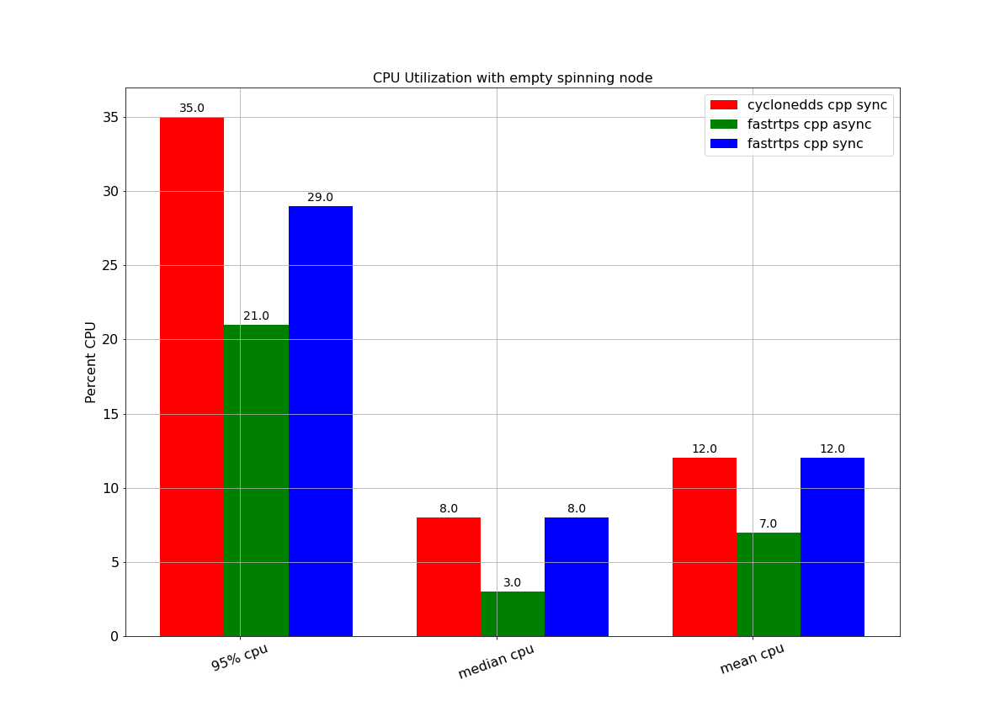
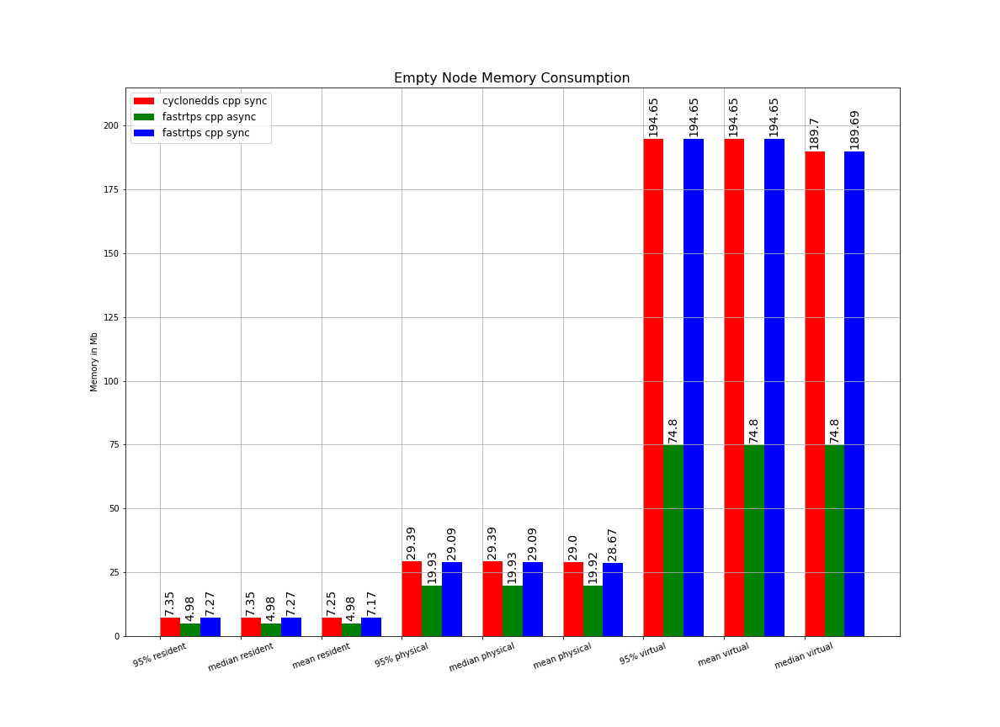
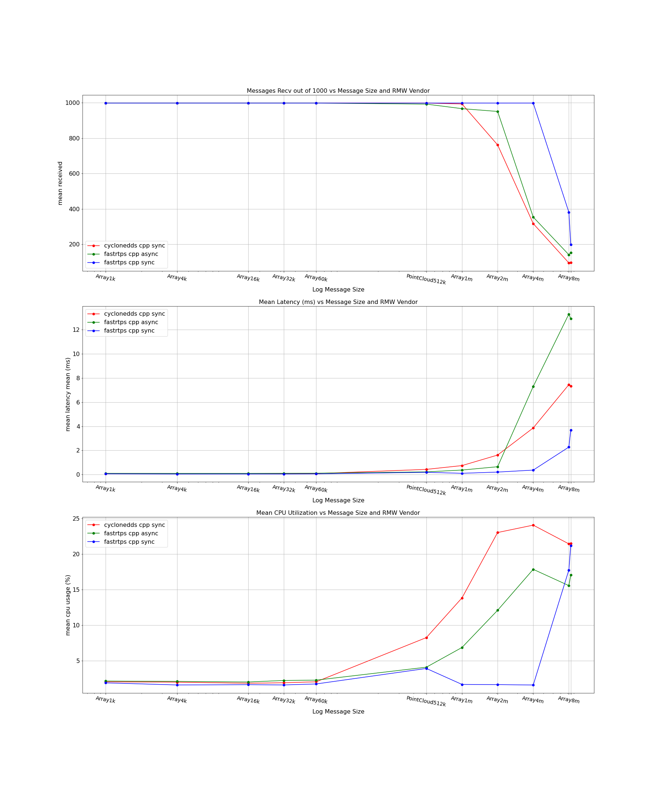
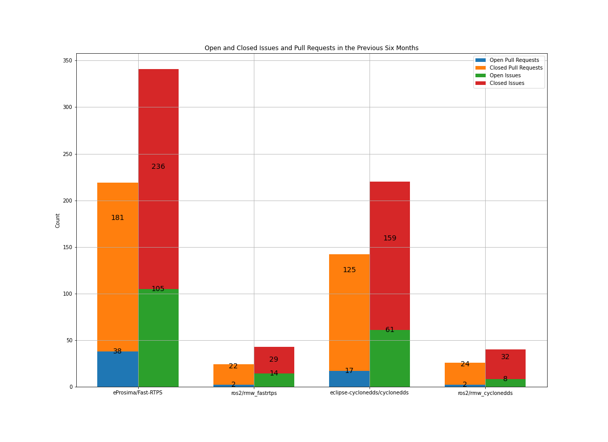
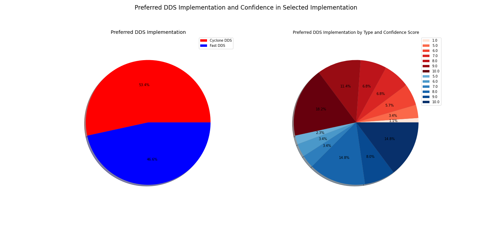
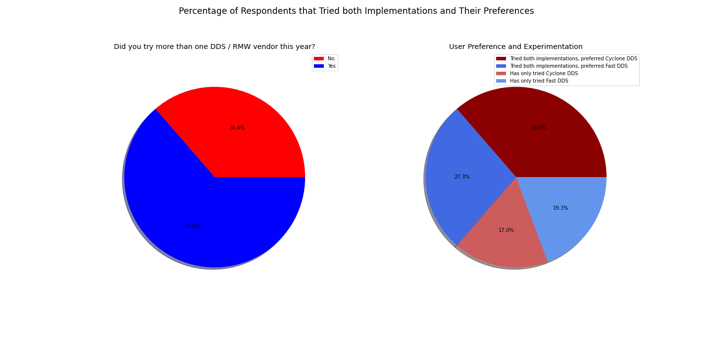

# 2021 ROS Middleware Evaluation Report

###  October 14, 2021

### Prepared by: Katherine Scott, Chris Lalancette, Audrow Nash

# Index

* [Introduction](#Introduction)
* [Executive Summary](#ExecutiveSummary)
* [Build Farm Performance Metrics](#BuildFarm)
* [REP-2004 Code Quality Metrics](#CodeQuality)
* [GitHub User Statistics](#GitHubStats)
* [User Survey Results](#Survey)
* [DDS Provider Responses](#DDSProviderResponses)
* [Appendix](APPENDIX.md)

#  Introduction

This report is intended to serve as a guide for the selection of the default ROS middleware (RMW) implementation for the ROS 2 Humble Hawksbill release.
It provides information about the qualifying Tier 1 RMW implementations through objective application performance from the ROS 2 buildfarm, community engagement data, and through response to a questionnaire given to each of the RMW providers.
The report is intended to be purely informational and non-prescriptive; meaning it does not make a recommendation for the default middleware.
The default ROS 2 Humble middleware implementation will be selected by the ROS 2 Technical Steering Committee (TSC) after evaluation by both the ROS 2 Middleware Working Group and the TSC.

In order to be considered for this report, RMW implementations needed to meet a minimum bar:

1. It is considered a Tier 1 implementation in [REP-2000](https://www.ros.org/reps/rep-2000.html)
1. Both the RMW implementation and and the middleware it depends on are open-source projects under a permissive license
1. It is based on a middleware that uses RTPS or is a DDS implementation

Two RMW implementations currently meet this minimum bar: `rmw_cyclonedds_cpp` based on Cyclone DDS and `rmw_fastrtps_cpp` based on Fast RTPS.
From here on out, Cyclone DDS will be used synonymously with `rmw_cyclonedds_cpp` and Fast RTPS will be used synonymously with `rmw_fastrtps_cpp` unless otherwise specified.
This report evaluates these two DDS implementations along with their RMW implementations for ROS 2, namely Cyclone DDS and Fast RTPS (this is now called Fast DDS, but this report will continue to refer to it as Fast RTPS).

The application performance and community engagement is measured objectively by Open Robotics along 4 axes:

* [Build Farm Performance Metrics](#BuildFarm) - this dataset covers basic RMW performance in terms of memory, CPU utilitization, and lost messages using a simplified network under optimal conditions
* [REP-2004 Code Quality Data](#CodeQuality) - this simple table represents the [REP-2004](https://www.ros.org/reps/rep-2004.html) code quality standards as implemented for both the RMW and the underlying DDS implementation
* [GitHub User Statistics](#GitHubStats) - this section looks at GitHub community engagement data over the preceding six months for both the RMWs and DDS implementations
* [User Survey Results](#Survey) - this section presents the results of a survey of the ROS 2 community asking them about the overall end-user experience

The RMW providers were each asked a series of questions that are current concerns of the ROS 2 TSC.
The questionnaire that was provided is available [here](dds_provider_question_template.md).
The results in each of the responses are necessarily biased, and because the hardware and software used for each providers response is different, no direct comparison is possible.
However, the manner in which the providers responded to the questionnaire should give some insights into how they are thinking about the problems that ROS 2 users are facing.

#  Executive Summary

This section will attempt to summarize the most important parts from each of the sections in this report.

In [Section 1](#-1-build-farm-performance-metrics), the plots in [1.2.1](#121-cpu-utilization-in-a-spinning-node-by-rmw) and [1.2.2](#122-memory-utilization-in-a-spinning-node-by-rmw) show nearly identical performance between Cyclone DDS and Fast RTPS with synchronous publishing.
However, comparing the results to the [2020 report](../galactic/README.md), it is clear that both implementations now use more CPU and more memory than before.

Also in [Section 1](#-1-build-farm-performance-metrics), plots in [1.2.3](#123-subscriber-cpu-utilization-latency-and-lost-messages-by-message-type-and-rmw) show Fast RTPS with synchronous publishing to be the best implementation, having the same shape to the curve as message size increases, but with a better score in each case.
Note, these plots show only a single run of the performance tests each, as they come from a single night of the nightly performance jobs.
They also show clear trade-offs between synchronous and asynchronous publishing modes.

In [Section 2](#-2-rep-2004-code-quality-metrics), adherence to [REP-2004](https://www.ros.org/reps/rep-2004.html) is compared.
The implementations are quite similar, despite some inconsistencies in the reporting due to differences in self reporting.
Under most of the categories for the parts that are documented each implementation are comparable.
Despite this there is an appreciable difference as Cyclone DDS is currently declared as quality level 2, and Fast RTPS is rated as quality level 1.

In [Section 3](#-3-github-user-statistics), data from GitHub about the two vendor's repositories is compared, and we see similar results.
Issues are handled in a timely fashion for the most part, and those that are not could be special cases.
It is difficult to draw a meaningful conclusion from the data available.

In [Section 4](#-4-user-survey-results), TODO

<!--
the user survey results are presented,
and there is a slight advantage for Cyclone DDS as highlighted in the plots for
section [4.2.5](#625-survey-question-drill-down-2). There are potential sources
of bias which may affect this result due to the fact that it relies on self
reporting. Generally speaking, Cyclone DDS Sync users are more likely to
recommend Cyclone DDS be used as the default RMW and recommend Cyclone DDS to a friend.
It is worth noting that [Section 6](#-6-user-survey-results), users of all
levels who submitted to the survey felt comfortable switching rmw implementations.
-->

In [Section 5](#-5-dds-provider-responses), the responses to the DDS provider survey are presented.
There are potential sources of bias which may affect this result due to the fact that it relies on self reporting.
The editors mention several points they found interesting while reading the reports.

#  1. Build Farm Performance Metrics

## 1.1 Overview and Description

The first dataset collected for evaluating RMW performance comes by way of the [ROS build farm](http://build.ros2.org). The ROS build farm hosts a collection of small integration tests that verify that a given RMW implementation performs acceptably when connected to either a single ROS node or a single ROS publisher sending messages to a single ROS subscriber.
Within the build farm there are also interoperability tests that examine the transport of messages between pairs of RMW/DDS implementations; however these tests are outside of the scope of this report.
For this section of the report we looked at the performance of two different testing regimes:

1. A single, spinning, ROS node backed by an DDS/RMW pair and instrumented to collect general performance data like mean and median CPU and memory consumption.
1. A ROS publisher and subscriber pair sending messages of varying sizes and instrumented to collect both host load statistics and network performance statistics.

All metrics for this portion of the report were collected using a custom [performance metrics tool](https://github.com/ahcorde/buildfarm_perf_tests/tree/master/test).
The Python Jupyter notebooks for pre-processing the data and plotting data can be found respectively [BuildFarmDataProcessing.ipynb](https://github.com/osrf/TSC-RMW-Reports/blob/main/humble/notebooks/BuildFarmDataProcessing.ipynb) and [BuildFarmPlots.ipynb](https://github.com/osrf/TSC-RMW-Reports/blob/main/humble/notebooks/BuildFarmPlots.ipynb).
The raw and post-processed data can be found in the [build_farm subdirectory](https://github.com/osrf/TSC-RMW-Reports/tree/main/humble/notebooks/data/build_farm).

## 1.2 Build Farm Test Results

The first set of data collected involved running a single, perpetually spinning ROS node a short time and collecting the peak, mean, and median, CPU and memory utilization statistics.
The figures below summarize the results for the Cyclone DDS RMW in synchronous configuration and Fast RTPS RMW in both the synchronous and asynchronous configuration.
Full plots of all the RMW variants and configurations are available in [Appendix A](APPENDIX.md#appendix_a).
The data for these plots was collected on August 31, 2021, and can be [downloaded using this link](http://build.ros2.org/job/Rci__nightly-performance_ubuntu_focal_amd64/387/artifact/ws/test_results/buildfarm_perf_tests/*.csv/*zip*/buildfarm_perf_tests.zip).
Summarized csv files can be found in the [data directory for the build farm test results](https://github.com/osrf/TSC-RMW-Reports/tree/main/humble/notebooks/data/build_farm).
Figure 1.2.1 provides the CPU performance while Figure 1.2.2 provides the memory performance including virtual, resident, and physical memory allocation.

A second bevy of tests were run using a single publisher and a single subscriber communicating across a host machine while varying both the underlying RMW as well as the message size.
The publisher and subscriber were instrumented to collect both system performance metrics and transmission metrics.
We have selected a few illustrative examples from the set to share including subscriber CPU versus message size, messages received versus message size, and message latency versus message size in figure 1.2.3.

### 1.2.1 CPU Utilization in a Spinning Node By RMW

This plot shows the CPU usage of a single, empty spinning node.
The node being empty means that it has no publishers, subscribers, services, actions, or timers attached.
Thus, this is a test of just the overhead of a node. The 95% CPU measurement indicates the 95% percentile (i.e. peak) CPU utilization of the node.

### 1.2.2 Memory Utilization in a Spinning Node By RMW

This plot shows the memory usage of a single, empty spinning node.
The node being empty means that it has no publishers, subscribers, services, actions, or timers attached.
Thus, this is a test of just the overhead of a node.
The 95% memory measurement indicates the 95% percentile (i.e. peak) memory utilization of the node.

### 1.2.3 Subscriber CPU Utilization, Latency, and Lost Messages By Message Type and RMW

In this plot, 1000 messages of the specified size were sent between a publisher and subscriber on the same machine.
For each message size, the plots show how many messages out of 1000 were received by the publisher, the average latency to receive each of the messages, and the average CPU utilization to receive the messages.
For this plot, Quality of Service options of best-effort, keep last, and a depth of 10 were used.

## 1.3 Build Farm Test Discussion

In the empty spinning node case, both RMW implementations are reasonably close in terms of CPU usage and memory consumption.
However, comparing the results to the [2020 report](../galactic/README.md), it is clear that both implementations now use more CPU and more memory than before.

In terms of messages received both RMW implementations appear to perform well up until the 1MB message size.
After that point, we see a divergence in the implementations.
Cyclone DDS starts dropping messages at the 2MB size, and continues to drop more messages as the size increases.
Fast RTPS async receives all messages at the 2MB size, and starts dropping messages after that.
Fast RTPS sync mode receives all messages up until 4MB size, and starts dropping messages after that.
It should be noted that compared to the [2020 report](../galactic/README.md), both implementations now deal with 2MB sizes better than before, with Fast RTPS showing a larger improvement.

For the message received latency, both RMW implementations are approximately the same up until the PointCloud512k message size.
Starting at the 1MB message size, the latency with Cyclone DDS approximately doubles for each step up in size.
Starting at the 1MB message size, the latency with Fast RTPS async goes up slowly until the 4MB size, where it spikes dramatically.
Fast RTPS sync has the best results here, with latency slowly increasing until the final test.
Compared to the [2020 report](../galactic/README.md), Cyclone DDS sync and Fast RTPS async are approximately the same, with Fast RTPS sync showing a noticeable improvement.

Finally, for CPU usage all of the RMW implementations are about the same until the 60k message size.
After that, the Cyclone DDS CPU usage goes up quickly with the amount of data being sent, spiking at the 2MB size and then lowering from there.
The Fast RTPS async CPU usage spikes at 2MB, and then starts going down a lot more dramatically.
In both of those cases, that is likely happening because more messages are being dropped after 2MB.
The Fast RTPS sync CPU usage goes up at the PointCloud512k size, drops dramatically for the 1MB, 2MB, and 4MB sizes, and then spikes again for the 8MB size.
It isn't completely clear on why that happens.
Compared to the [2020 report](../galactic/README.md), Cyclone DDS sync and Fast RTPS async are approximately the same, with Fast RTPS sync showing a very different performance curve.

#  2. REP-2004 Code Quality Metrics

## 2.1 Overview and Description

Code quality is an important metric for project health.
ROS 2 has defined various levels of package quality in [REP-2004](https://ros.org/reps/rep-2004.html).
Declaring a package to be in one of those quality levels means that it meets all of the requirements for that particular quality level.
The quality level of each of the middlewares and their RMW implementation is summarized below.
For more details, the reader is encouraged to look at the corresponding source repository for each middleware or RMW, where the quality level is declared in a file named QUALITY_DECLARATION.md or similar.

## 2.2 Results

| Package/Quality Metric | [Cyclone DDS](https://github.com/eclipse-cyclonedds/cyclonedds/blob/96a0374bdbb12a7d535dbc81092c3d87f2490ecb/CYCLONEDDS_QUALITY_DECLARATION.md) | [rmw_cyclonedds_cpp](https://github.com/ros2/rmw_cyclonedds/blob/2aa2cf527d079265195b2dca91bb9c82481be0c1/rmw_cyclonedds_cpp/QUALITY_DECLARATION.md) | [Fast RTPS](https://github.com/eProsima/Fast-DDS/blob/4a27fbbbeb08ad83ffa10422eeaa201017382905/QUALITY.md) | [rmw_fastrtps_cpp](https://github.com/ros2/rmw_fastrtps/blob/daeeb8c7c57eec3df0a82aaf91a1b4e94aa889e3/rmw_fastrtps_cpp/QUALITY_DECLARATION.md) |
| ---------------------- | -------------- | -------------- | -------------- | -------------- |
| Current Quality Level  |        2       |       4        |        1       |        2       |
| 1. Version Policy      | 1. follows semver but major 0 is stable 2. current version is stable 3. `dds_` or `DDS_` symbols are public API, others may change 4. no major releases in stable allowed 5. no major releases in stable allowed 6. patch releases allowed, minor allowed after assessing ABI stability, major releases allowed if accompanied by `rmw_cyclonedds_cpp` update | 1. follows semver 2. current version < 1.0.0 3. public API is in the rmw headers 4. no major releases in stable allowed 5. no major releases in stable allowed 6. no major releases in stable allowed | 1. follows semver 2. current version is stable 3. API documentation [available](https://fast-dds.docs.eprosima.com/en/latest/fastdds/api_reference/api_reference.html) 4. no major releases in stable allowed 5. only minor releases break ABI 6. N/A | 1. follows semver 2. current version is stable 3. public API is in the headers 4. no major releases in stable allowed 5. no major releases in stable allowed 6. no major releases in stable allowed |
| 2. Change control      | 1. changes must be in PR 2. DCO required 3. one review for merge (except when no reviewers available) 4. CI required to pass 5. documentation required | 1. changes must be in PR 2. DCO required 3. at least one review required for merge 4. CI required to pass 5. documentation required | 1. changes must be in a PR 2. DCO required 3. at least one review required for merge 4. CI required to pass 5. documentation required | 1. changes must be in PR 2. DCO required 3. at least one review required for merge 4. CI required to pass 5. documentation required |
| 3. Documentation       | 1. concept documentation refers to DDS spec 2. API docs are embedded in the code 3. Eclipse Public License 2.0/Eclipse Distribution License 1.0 4. copyright statement included with the code | 1. features are documented via rmw API 2. public API docs in rmw, other API docs embedded in code 3. Apache 2.0 license 4. copyright statement included with the code | 1. features are documented 2. API reference is hosted at [readthedocs](https://fast-dds.docs.eprosima.com/en/latest/fastdds/api_reference/api_reference.html) 3. Apache 2.0 license 4. copyright statement included with the code | 1. some features are documented 2. API docs are embedded in the code 3. Apache 2.0 license 4. copyright statement included with the code |
| 4. Testing             | 1. system tests cover features 2. tests cover all of the public API 3. line coverage should increase with changes 4. no performance tests 5. uses coverity for static analysis | 1. system tests cover features 2. system tests cover APIs 3. line coverage should keep or increase, but decreases are allowed if justified 4. No performance tests 5. uses standard ROS linters and tests | 1. simulation tests cover features 2. tests cover typical usage of public API 3. line coverage should keep or increase, but decreases are allowed if justified 4. automatic performance test on changes 5. uses linters, but only for new code | 1. system tests cover features 2. unit and system tests cover the API 3. line coverage should increase with changes, but decreases allowed with justification 4. no performance tests 5. uses standard ROS linters and tests |
| 5. Dependencies        | 1. no ROS deps 2. no ROS deps 3. OpenSSL external dep | 1. all direct deps have Quality Declaration except for rosidl_typesupport_introspection_c{pp} 2. no optional direct runtime ROS deps 3. Eclipse Cyclone DDS claims to be at QL 2 | 1. no ROS deps 2. no ROS deps 3. libasio, libtinyxml2, Fast CDR, foonathan_memory, and OpenSSL* external deps | 1. all direct runtime ROS deps declare quality level 2. no optional direct runtime ROS deps 3. Fast CDR/Fast RTPS claim to be at QL 1 |
| 6. Platform            | 1. supports all ROS 2 Tier 1 platforms | 1. supports all ROS 2 Tier 1 platforms | 1. supports all ROS 2 Tier 1 platforms | 1. supports all ROS 2 Tier 1 platforms |
| 7. Security            | 1. conforms to [REP-2006](https://ros.org/reps/rep-2006.html) | 1. conforms to [REP-2006](https://ros.org/reps/rep-2006.html) | 1. [Vulnerability disclosure policy](https://github.com/eProsima/policies/blob/main/VULNERABILITY.md) | 1. Conforms to [REP-2006](https://ros.org/reps/rep-2006.html) |

\* OpenSSL dependency for Fast RTPS is optional, but used in ROS 2.

## 2.3 Discussion

Compared to last year, Cyclone DDS now has a Quality Level defined for `rmw_cyclonedds_cpp`.

The packages implementing the DDS/RTPS protocol (`Cyclone DDS` and `Fast RTPS`) are comparable in most respects.
The key differences seem to be:

* Cyclone DDS relies on the OMG DDS standard for documenting the features, while Fast RTPS has dedicated documentation
* Cyclone DDS does not have automated performance tests, while Fast RTPS does
* Cyclone DDS conforms to REP-2006 for security vulnerability reporting, while Fast RTPS has its own, largely equivalent, security process

The packages implementing the interface to ROS 2 (`rmw_cyclonedds_cpp` and `rmw_fastrtps_cpp`) are generally comparable.
Here are some of the key differences:

* `rmw_cyclonedds_cpp` has a major version number < 1, while `rmw_fastrtps_cpp` has a major version number > 1
* `rmw_cyclonedds_cpp` features are documented via the `rmw` API, while `rmw_fastrtps_cpp` relies on the README, the `rmw` docs, and the `Fast RTPS` docs
* `rmw_cyclonedds_cpp` is missing a Quality Declaration for the `rosidl_typesupport_introspection_c{pp}` dependency, while `rmw_fastrtps_cpp` has a Quality Declaration for all dependencies

As a reminder, all of the quality levels for the various packages are self-declared.

#  3. GitHub User Statistics

## 3.1 Overview and Statistics

Responsiveness to issues and pull requests in a GitHub repository is a good proxy measurement for how quickly a given provider responds to their customers and
users.
The number of pull requests, and how quickly they are closed, can also give us an indication to how much development is taking place on a given code base and how quickly issues are being resolved.
To examine the responsiveness and development velocity of both RMW providers we used the GitHub API to collect commit, pull request, and issue data for the 180 days before the report was drafted on October 11, 2021.
The process of collecting this data was divided into two parts, data collection which can be found in [this notebook](./notebooks/GetGitRMWDDSMetrics.ipynb), and data analysis which can be [found here](./notebooks/PlotGithubStats.ipynb).

## 3.2 GitHub Engagement Results

### 3.2.1 Open and Closed Pull Requests in the Previous Six Months

The following plot gives the open and closed issues and pull requests broken down by both DDS implementation and RMW implementation.

### 3.2.2 Cumulative Time to Close Pull Requests and Issues

These cumulative histograms give the percentage of issues and pull requests closed within a certain time frame over the 180 day sample period.

## 3.3 GitHub Metrics Discussion

Generally, for the six month period sampled, both providers are doing a great job responding to both issues and pull requests.
Both the main Cyclone DDS repository and the RMW implementation are slightly faster to close issues and pull requests than the Fast RTPS equivalents.
Fast RTPS has about 1.5 times as many pull requests and issues as Cyclone DDS.
This may be down to a number of factors, including the development practices, the number of ROS users, addressing bugs and feature requests, etc.

#  4. User Survey Results

#  5. DDS provider responses

## 5.1 Overview

As previously mentioned, each of the candidate DDS providers was given a [questionnaire](dds_provider_question_template.md) to respond to.
The questions provided all came from TSC members, and represent a subset of the concerns facing the ROS 2 community.
The responses from each of the providers is below:

* [2021 Eclipse Cyclone DDS ROS Middleware Evaluation Report with iceoryx and Zenoh](eclipse-cyclonedds-report.md)

* [Fast DDS TSC RMW report 2021](eProsima-response.md)

## 5.2 Discussion

The two reports were taken with different hardware by different people at different times.
*Additionally, the Fast DDS response is using [this ros2.repos](./ros.repos) file from August 31, 2021, while the Cyclone DDS response is using Galactic Patch Release 1.*
All of these factors mean that the two reports are not directly comparable in any meaningful sense.
The reader is encouraged to look at the way in which the providers answered the concerns coming from the community.
This can give insight into how, and how much, a provider is thinking about any particular issue.

Since the two reports are vastly different, a detailed comparison will not be provided here.
Here are some interesting points the editors noticed while reading the reports:

* Looking at the provider responses, Cyclone DDS answered all of the questions.  Fast DDS answered all of the questions except for the one that says "How well does the implementation work out-of-the-box over WiFi?".

* For the performance tests, the Cyclone DDS plots show up to 50 subscribers, while the Fast DDS ones only show up to 10 subscribers.

* In terms of memory usage, both of the reports agree that Fast DDS has higher memory usage in the usual cases.  According to the eProsima report, this is because Fast DDS support more configurations and options.

* Service scalability is hampered because neither has Content Filtering, but that is on the roadmap for both.

* For the WiFi answers, both providers mentioned that additional configuration is needed in order to make WiFi work better.  In the Fast DDS case, this is by either providing a list of Initial Peer node (through XML configuration), or by setting up a Discovery Server.  In the Cyclone DDS case, this is by deploying Zenoh to deal with WiFi communications in a different way.
